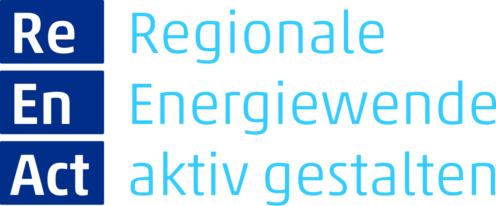

# Actively shaping the regional energy transition

## Goal

This project is about the inclusion of stakeholders in the
planning of renewable energy projects, and it is conducted by 
WindEnergy Network e.V. (WEN), Reiner Lemoine Institut (RLI), DUENE e.V., Stadtgespräche e.V. (SG), Rostocker 
Institut für Sozialforschung (ROSIS) and Hochschule Stralsund (HOST) as project lead.

## Concept and Progression

As a foundation for developing an informed opinion and making good decisions, stakeholders should be provided with a tool,
that helps them to comprehend the effect that more or less renewable generation capacity has on their local community, as 
well as the energy system as a whole. To achieve this, an easy-to-use tool will be built, that is intuitively usable,
without much need for a training beforehand.

There are two parts to this tool: first the graphical interface, that the user gets to see and he or she can input
parameters for an energy system and where the output is displayed; and secondly the calculations in the background,
which consist of an energy system model, that is built according to the parameters and that is then optimized. 
The modelling and optimization is done by oemof.solph and oemof.tabular is used to read the model components and 
parameters in a datapackage format. Parameters (e.g. cost and installed capacity, as well as capacity potential) can be
read directly from the CSV-files and are based upon research by project partners.

The project kick-off was in january 2024. After that the collection of data began. Starting in summer 2024 until
early 2025 locals and regional businesses were asked for their thoughts about the energy system and transition. In
summer 2025 there was an information event to present the project and there was further talks with residents.
Parallel to those events was the development of the stakeholder empowerment tool.
All this culminated in the first "Planungszelle" (planning board) about the future of the local energy system, in autumn 2025.
The next steps will be more development work on the tool and scenarios, as well as the sociological research of this 
kind of stakeholder involvement.

You can find more information about the project and the team on this [website](https://www.energieregion-peenetal.de) (in german).
